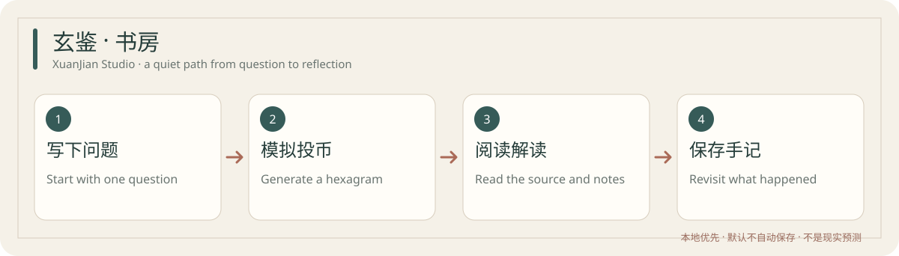

# XuanJian Studio · 玄鉴·书房

**A quiet, local-first place to study the *I Ching* and revisit your own questions.** The interface and classical texts are currently in Chinese. The public repository provides source code; a standalone Mac installer remains a trial candidate pending final first-launch checks.



[中文说明](README.md) · [Source checks](https://github.com/jojo232386/xuanjian-studio/actions/workflows/ci.yml) · [MIT license](LICENSE)

## What you can do

1. Write one concrete question, then generate a six-line hexagram through simulated three-coin throws or enter your own physical coin results.
2. Read a short local interpretation alongside the original and changed hexagrams and cited line texts.
3. Save the result only when you choose to, then add a follow-up note after events unfold.

The app also includes Bazi, Zi Wei Dou Shu and Qi Men Dun Jia calculations, Chinese calendar lookup, and the 81 chapters of the *Dao De Jing*. Notes stay on the local device by default. Encrypted export and optional WebDAV sync are available. Cloud AI is optional and disabled by default.

The readings are **cultural study and reflection**, not forecasts or a substitute for medical, legal, financial, or other real-world evidence. The 384 line texts are an attributed electronic transcription and have not all been independently checked against critical editions. Calendar labels are not measured probabilities.

## Run from source

Requires Python 3.14 and Node.js 22:

```bash
python3 -m venv .venv
.venv/bin/python -m pip install -r requirements.txt
npm --prefix frontend ci
npm --prefix frontend run build
.venv/bin/python backend/server.py
```

Open `http://127.0.0.1:8788/`. Development data is stored under `data/` in the project directory. Do not commit notes, databases, credentials, or backups.

For a reproducible command-line calculation:

```bash
PYTHONPATH=. .venv/bin/python scripts/iching.py lines 7 8 7 8 9 6
```

This fixed input produces the original hexagram **Ji Ji**, moving lines **5 and 6**, changed hexagram **Bi**, and nuclear hexagram **Wei Ji**. It is a calculation check, not a prediction.

## Verify and contribute

Install `requirements-dev.txt`, build the frontend, then run:

```bash
.venv/bin/python -m pytest -q -p no:cacheprovider --ignore=tests/test_macos_client_app_e2e.py
```

The macOS app tests build a self-contained bundle and run it with isolated temporary data. The public CI checks source on Linux and packaging, notices, non-network tests, and archive extraction on a fresh Apple Silicon runner. GitHub has a [known macOS runner issue with Python localhost listeners](https://github.com/actions/runner-images/issues/14409), so local HTTP behavior is not inferred from that runner. A successful CI job does not verify the interactive Gatekeeper first-launch path on another person's Mac.

See [CONTRIBUTING.md](CONTRIBUTING.md) for good first contributions and [SOURCES_AND_LICENSES.md](SOURCES_AND_LICENSES.md) for software and classical-text provenance. Source code is MIT licensed; bundled third-party code retains its own notices.
